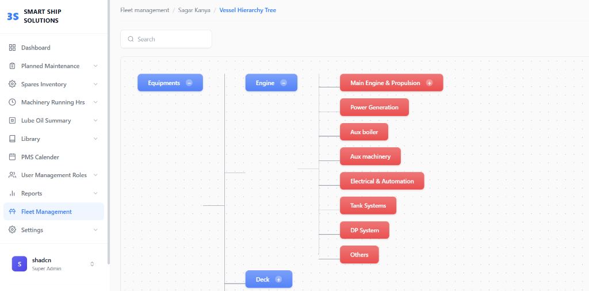
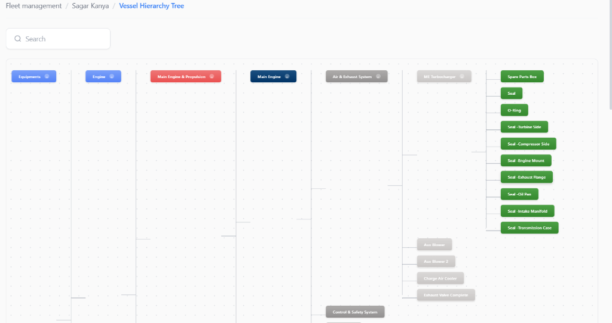
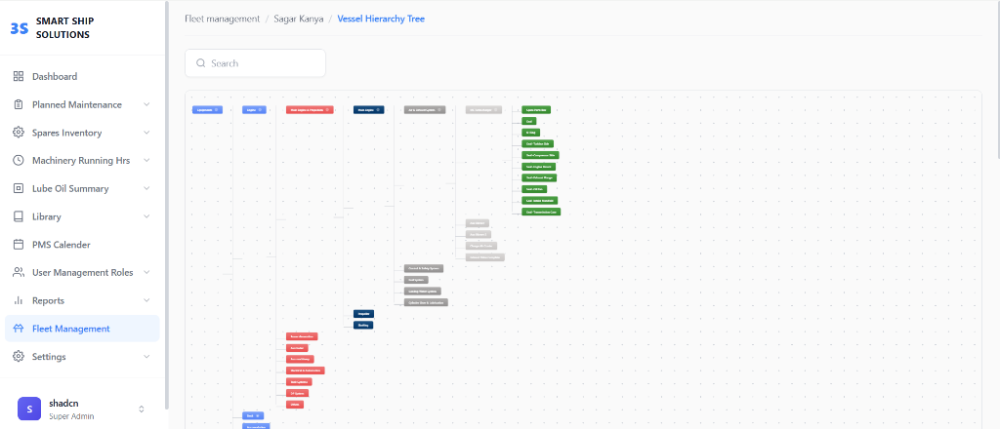

# Vessel Hierarchy Tree

A React-based interactive hierarchy tree visualization for vessel equipment management, built for 3S Smart Ship Solutions.

## Features

- **Interactive Tree Visualization**: Expandable and collapsible nodes representing vessel equipment hierarchy.
- **Color-Coded Nodes**: Distinct visual styles for different hierarchy levels (Equipment, Assembly, Component, etc.) matching Figma designs.
- **Search Functionality**: Filter nodes by name with auto-expansion of matched paths and highlighting.
- **Zoom & Pan Controls**: Navigate large trees easily with built-in zoom and pan capabilities.
- **Responsive Layout**: Sidebar navigation and breadcrumb header for a complete application experience.

## Technology Stack

- **Framework**: React 19 + TypeScript
- **Build Tool**: Vite
- **Styling**: Vanilla CSS (with CSS Variables for theming) + Tailwind CSS (configured)
- **Icons**: SVG Icons

## Getting Started

### Prerequisites

- Node.js (v16 or higher)
- npm or yarn

### Installation

1. Clone the repository:
   ```bash
   git clone <repository-url>
   ```

2. Navigate to the project directory:
   ```bash
   cd hierarchical-tree
   ```

3. Install dependencies:
   ```bash
   npm install
   ```

### Running the Application

Start the development server:
```bash
npm run dev
```

Open [http://localhost:5173](http://localhost:5173) to view it in the browser.

### Building for Production

Build the app for production:
```bash
npm run build
```

Preview the production build:
```bash
npm run preview
```

## Project Structure

```
src/
├── components/
│   ├── Header/         # Breadcrumb header
│   ├── SearchBar/      # Search input component
│   ├── Sidebar/        # App navigation sidebar
│   ├── TreeNode/       # Recursive tree node component
│   └── TreeView/       # Main container with zoom/pan logic
├── data/
│   └── hierarchyData.ts # Static JSON data for the tree
├── types/
│   └── types.ts        # TypeScript interfaces and enums
├── App.tsx             # Main application layout
└── index.css           # Global styles and tailwind import
```

## Component Architecture

```
┌─────────────────────────────────────────────────────────────────┐
│                           App.tsx                               │
│  ┌──────────────┐  ┌──────────────────────────────────────────┐ │
│  │   Sidebar    │  │            Main Content                  │ │
│  │              │  │  ┌────────────────────────────────────┐  │ │
│  │  • Logo      │  │  │           Header.tsx               │  │ │
│  │  • Nav Menu  │  │  │  (Breadcrumb Navigation)           │  │ │
│  │  • User Info │  │  └────────────────────────────────────┘  │ │
│  │              │  │  ┌────────────────────────────────────┐  │ │
│  │              │  │  │         SearchBar.tsx              │  │ │
│  │              │  │  │  (Filter input with clear button)  │  │ │
│  │              │  │  └────────────────────────────────────┘  │ │
│  │              │  │  ┌────────────────────────────────────┐  │ │
│  │              │  │  │         TreeView.tsx               │  │ │
│  │              │  │  │  • Zoom/Pan Controls               │  │ │
│  │              │  │  │  • Expand/Collapse All             │  │ │
│  │              │  │  │  • Search Matching Logic           │  │ │
│  │              │  │  │  ┌──────────────────────────────┐  │  │ │
│  │              │  │  │  │      TreeNode.tsx            │  │  │ │
│  │              │  │  │  │  (Recursive Component)       │  │  │ │
│  │              │  │  │  │  • Node Pill (color-coded)   │  │  │ │
│  │              │  │  │  │  • Connector Lines           │  │  │ │
│  │              │  │  │  │  • Expand/Collapse Button    │  │  │ │
│  │              │  │  │  │  • Children Container        │  │  │ │
│  │              │  │  │  └──────────────────────────────┘  │  │ │
│  │              │  │  └────────────────────────────────────┘  │ │
│  │              │  │  ┌────────────────────────────────────┐  │ │
│  │              │  │  │           Footer                   │  │ │
│  └──────────────┘  │  └────────────────────────────────────┘  │ │
│                    └──────────────────────────────────────────┘ │
└─────────────────────────────────────────────────────────────────┘
```

### Component Responsibilities

| Component | Responsibility |
|-----------|---------------|
| **App.tsx** | Root layout, manages global search state, composes all major components |
| **Sidebar** | Navigation menu with icons (Heroicons), user profile, branding |
| **Header** | Breadcrumb navigation showing current location |
| **SearchBar** | Controlled input for filtering tree nodes by name |
| **TreeView** | Container managing zoom/pan state, expand/collapse all, search result processing |
| **TreeNode** | Recursive component rendering individual nodes with connectors and children |

### Data Flow

```
User Input (Search) → App.tsx (state) → TreeView.tsx (process matches)
                                              ↓
                                     TreeNode.tsx (highlight + expand)
```

## Trade-offs & Assumptions

### Design Decisions

| Decision | Rationale | Trade-off |
|----------|-----------|-----------|
| **Recursive Component** | Natural fit for tree data structure, clean code | Deep trees (100+ levels) could cause stack issues |
| **CSS-based Animations** | Hardware-accelerated, smooth 60fps | More complex state management for animation timing |
| **Client-side Search** | Instant filtering, no API latency | Not suitable for trees with 10,000+ nodes |
| **Transform-based Pan/Zoom** | Preserves DOM structure, better performance | Requires manual coordinate calculations |
| **Static Data (JSON)** | Demo simplicity, no backend needed | Production would need API integration |

### Assumptions

1. **Tree Depth**: Designed for hierarchies up to ~10 levels deep (typical for vessel equipment)
2. **Node Count**: Optimized for trees with <1000 nodes; larger datasets may need virtualization
3. **Browser Support**: Modern browsers (Chrome, Firefox, Edge, Safari) with ES6+ support
4. **Screen Size**: Minimum viewport of 1024px width recommended for optimal experience
5. **Single Root**: Tree assumes a single root node (the vessel)

### Future Improvements

- [ ] **Virtualization**: Implement windowing for large node sets (react-window)
- [ ] **Keyboard Navigation**: Arrow keys to traverse nodes, Enter to expand
- [x] **Drag & Drop**: Reorder nodes within the hierarchy ✅
- [ ] **Lazy Loading**: Fetch children on-demand for deep hierarchies
- [x] **Export**: Download tree as PNG/SVG ✅
- [ ] **Undo/Redo**: Track expansion state history

## Screenshots

### Main View


### Search & Filtering


### Deep Hierarchy Zoom


---
© 2025 3S Smart Ship Solutions
